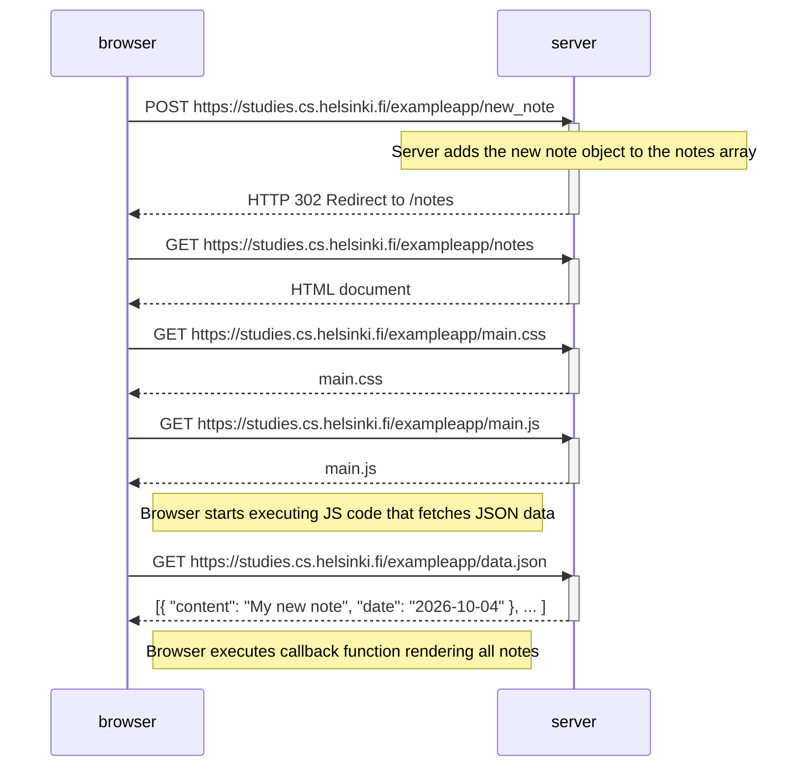
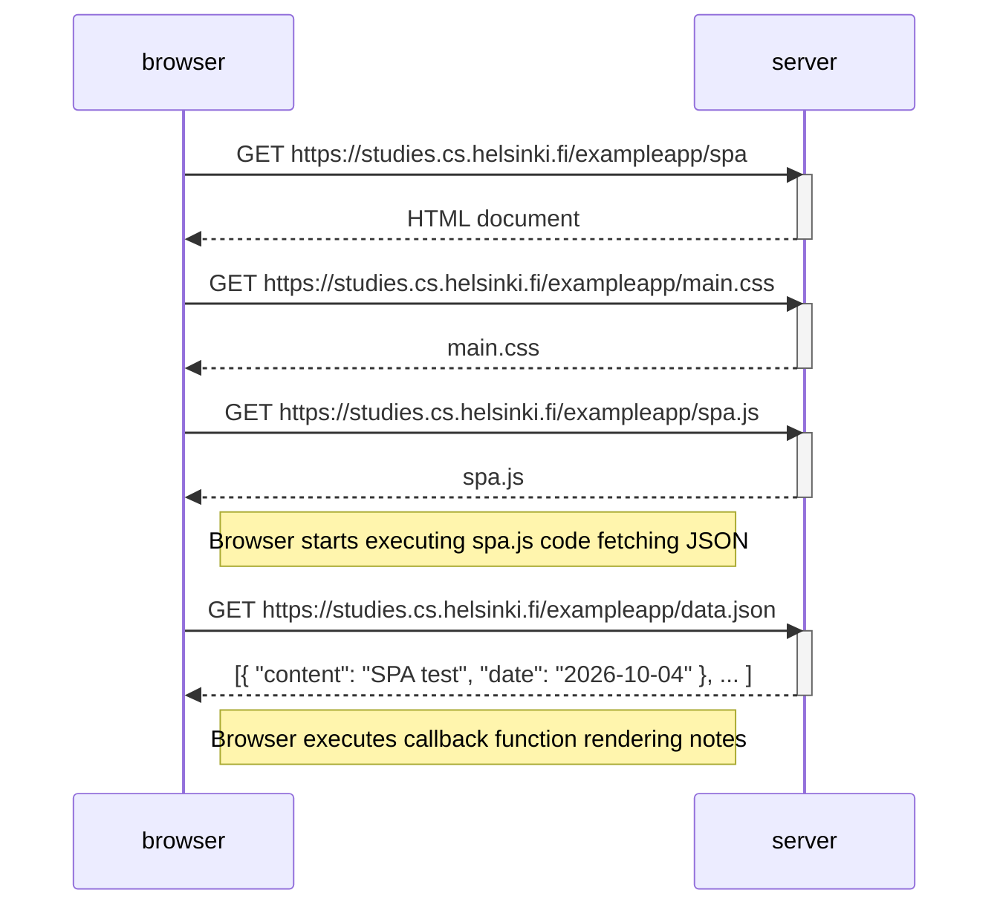
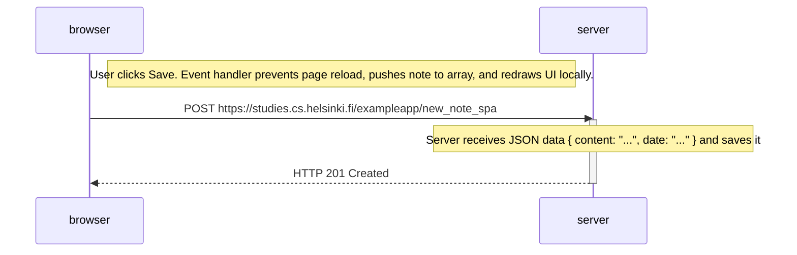

hello world

# fullstackopen-part-0

Exercise 0.4: new note diagram

```mermaid
sequenceDiagram
    participant browser
    participant server

    browser->>server: POST https://studies.cs.helsinki.fi/exampleapp/new_note
    activate server
    Note over server: Server adds the new note object to the notes array
    server-->>browser: HTTP 302 Redirect to /notes
    deactivate server

    browser->>server: GET https://studies.cs.helsinki.fi/exampleapp/notes
    activate server
    server-->>browser: HTML document
    deactivate server

    browser->>server: GET https://studies.cs.helsinki.fi/exampleapp/main.css
    activate server
    server-->>browser: main.css
    deactivate server

    browser->>server: GET https://studies.cs.helsinki.fi/exampleapp/main.js
    activate server
    server-->>browser: main.js
    deactivate server

    Note right of browser: Browser starts executing JS code that fetches JSON data

    browser->>server: GET https://studies.cs.helsinki.fi/exampleapp/data.json
    activate server
    server-->>browser: [{ "content": "My new note", "date": "2026-10-04" }, ... ]
    deactivate server

    Note right of browser: Browser executes callback function rendering all notes

```

Exercise 0.5: single page app diagram

```mermaid
sequenceDiagram
    participant browser
    participant server

    browser->>server: GET https://studies.cs.helsinki.fi/exampleapp/spa
    activate server
    server-->>browser: HTML document
    deactivate server

    browser->>server: GET https://studies.cs.helsinki.fi/exampleapp/main.css
    activate server
    server-->>browser: main.css
    deactivate server

    browser->>server: GET https://studies.cs.helsinki.fi/exampleapp/spa.js
    activate server
    server-->>browser: spa.js
    deactivate server

    Note right of browser: Browser starts executing spa.js code fetching JSON

    browser->>server: GET https://studies.cs.helsinki.fi/exampleapp/data.json
    activate server
    server-->>browser: [{ "content": "SPA test", "date": "2026-10-04" }, ... ]
    deactivate server

    Note right of browser: Browser executes callback function rendering notes
```

Exercise 0.6: new note in single page app diagram

```mermaid
sequenceDiagram
    participant browser
    participant server

    Note right of browser: User clicks Save. Event handler prevents page reload, pushes note to array, and redraws UI locally.

    browser->>server: POST https://studies.cs.helsinki.fi/exampleapp/new_note_spa
    activate server
    Note over server: Server receives JSON data { content: "...", date: "..." } and saves it
    server-->>browser: HTTP 201 Created
    deactivate server
```
